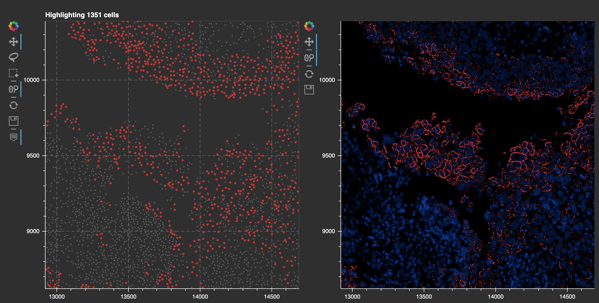
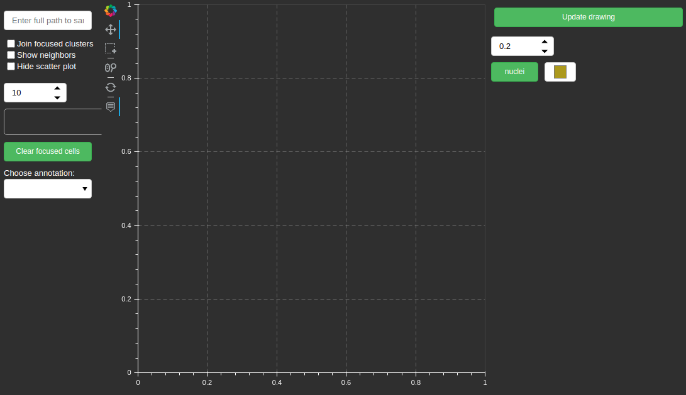
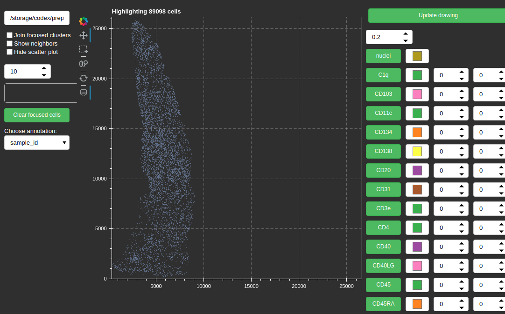
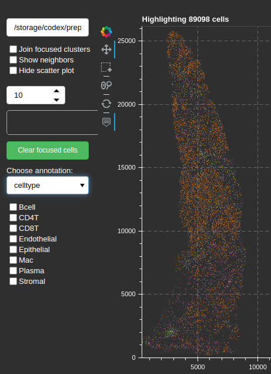
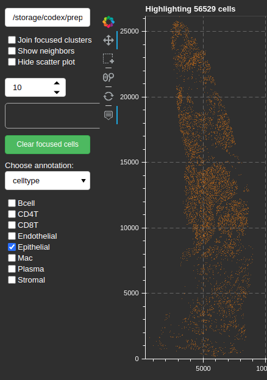
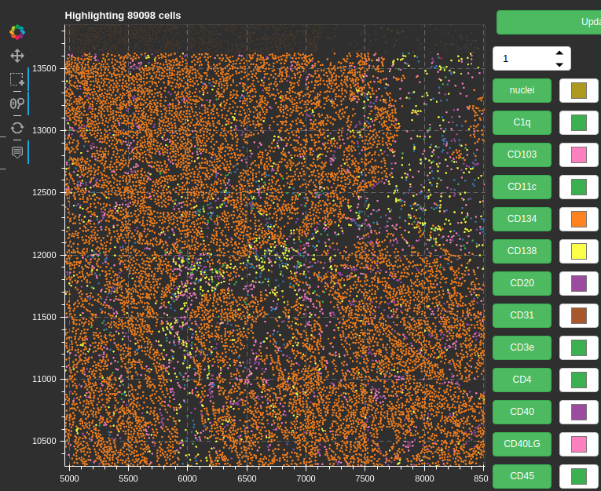
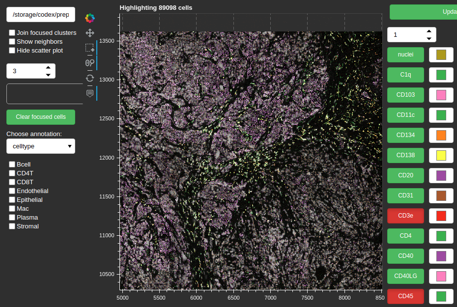
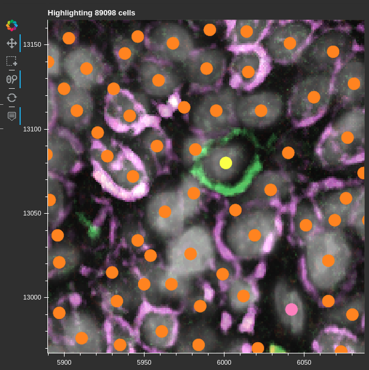

# Micron<sup>2</sup> :microscope:



*****  

- [x] [Segmentation](#segmentation) (via StarDist) :watermelon:
- [x] [CODEX cell dataset](#data-class)
- [x] [Single cell clustering](#single-cell-clustering)
- [x] [Niche detection](#niche-detection)
- [ ] [Spatial statistics](#spaital-statistics)
- [ ] Graph analysis
- [ ] [Interactive visualization](#codex-visual-analysis-platform)


******

With paired scSeq :test_tube::dna:
- [ ] Spatial constraints on interaction analysis (imaging --> scSeq)
- [ ] Interacting cells co-occurance frequency (scSeq --> imaging)
- [ ] Project RNA profiles into CODEX cells

See [snippets](#snippets) for usage.

*****

## Sub-goals

### Data class
- [x] store processed image data + nuclear masks + coordinates in hdf5
- [x] <u>short term</u>: wrapper to use AnnData and store a hook to an open cell image dataset
- [ ] <u>long term</u>: extend the AnnData class

### Segmentation
- [x] pull data from images and perform statistics on these data quickly
- [x] data loader for segmented data focusing on cells, tracking location and cell_ids

### Single cell clustering
- [x] cluster with normalized intensity values
- [x] cluster with morphology + staining
- [ ] (heirarchical or at-once) semi-supervised transfer of cell type labels 

### Niche detection
- [x] k-nearest neighbors graph
- [ ] set embedding with neighborhoods as sets 

### Spatial statistics
- [x] freuqency of neighbor celltypes
- [x] channel intensities compare neighbors vs non-neighbors for focused celltype
- [x] fisher test for co-occurance of celltypes within spatial niches
- [x] mean type-to-type distances
- [ ] spatial staining intensity correlation

### Interactive visualization
- [x] [Bokeh](https://bokeh.org/) for interactive data vis
- [ ] click to show nucleus image
- [x] histogram of image being actively edited
- [ ] select area and export images to file
- [ ] select area/cells and annotate
- [x] composable intensity plot
- [x] dual panes with cells on one side and select a square region to show it
- [ ] focus cluster + neighbors --- histogram of neighbor cell types/integrate with spatial stats
- [ ] widget to gate cells based on bi-variate staining intensity


*****
## Environment

[Miniconda](https://docs.conda.io/en/latest/miniconda.html), 
[RAPIDS](https://rapids.ai/),
[TensorFlow 2](https://www.tensorflow.org/),
[Bokeh](https://bokeh.org/),
[Scanpy](https://scanpy.readthedocs.io/en/stable/)

Note: to use the `leidenlag` package install the proper igraph package from pip: `pip install python-igraph`.

I've had problems getting certain versions of CUDA, RAPIDs and TensorFlow to co-exist within the same `conda` environment. Until some of these upstream conflicts are resolved, I run separate environments: one with RAPIDs, and one with TensorFlow.


****
## Getting started

We have some processed high-plex imaging data in the form of TIFF images, along with segmentations of the nuclear contours derived from some nuclear stain, and a table describing the centroids of these contours. 

#### Data model
Our data model is a directory structure like this:

```
sample/
  # Starting data
  images/                # ensure images are of uniform dimensions
    sample_DAPI.tif
    sample_CD45.tif
    sample_PanCytoK.tif

  sample_tissue.tif      # tissue segmentation - binary image
  sample_nuclei.tif      # nuclei segmentation - label image
  sample_membrane.tif    # dilated nuclei segmentation - label image
  sample_centroids.csv   # CSV with 3 columns: x, y, size of each nucleus

  # files we are going to produce
  sample.hdf5            # datasets of a nuclear images and marker statistics for each nucleus
  sample.h5ad            # collected marker statistics translated from `sample.hdf5`

experiment_config.json   # information about the `experiment` that `sample` belongs to
```

From this starting point, we'll collect individual nuclear images and a table of average intensities in an `hdf5` dataset. We provide a means for converting the average intensity values to `AnnData` objects for integration with the `scanpy` ecosystem.


****
## CODEX visual analysis platform

The goal of the viewer is to provide convenient browsing of CODEX data that has been processed using our [data model](#data-model). 
On the left of the interface, we load a `AnnData` formatted file to build a scatter plot of cells with in situ coordinates, and pull categorical columns from `obs` for viewing.
To the right are a set of controls for turning channels on and off, selecting their display color, and low/high saturation points.
Images are updated only when the user clicks the "Update drawing" button.

A brief visual guide is presented here.

First, navigate to the root of the `micron2` directory and run the start-up script:

```bash
(micron2) foo@bar $ cd micron2
(micron2) foo@bar $ ./start_bokeh.sh
```

The bokeh server runs on port 7755, this can be changed by editing the script. We also start the server in `debug` mode which means the app re-loads itself when it detects a change in one of the tracked files. Use an ssh tunnel to connect to a server running on a remote host, or specify your IP on a list of allowed connections.

You are greeted with this screen:



Specify a full path to the desired image **on the host file system** (not on your local file system, if the app is running remotely).
The scatter plot loads. The `Choose annotation` dropdown menu on the left populates, and available channels are shown on the right.
An indicator on top of the scatter plot shows the total number of cells in the dataset:



(LEFT) Select an annotation, the scatter plot changes colors. Colors defined in the `AnnData` object's `adata.uns['annotaton_name_colors']` field are pulled when possible, otherwise `tab20` is used for the default color map.

(RIGHT) Selecting one of the category check boxes highlights those cells, hiding all others. The information on top of the scatter area updates itself.




Use the controls to the immediate right of the scatter plot to pan (arrows), scroll-wheel zoom (magnifying glass), and slect regions.
Selecting a region, as shown in the screenshot, is recommended before loading images. I have selected a region in the middle of the sample, and changed the `downsample` parameter (right side, top) from the default `0.2` (20%) to `1` (100%; full-resolution).

By selecting a region, we are prepared to load the source images corresponding only to this piece of tissue.




Select channels by clicking their name to the right, and adjust their target color by using the color chooser widgets next to each channel. 
With larger panels such as this one, the channel list is continued by scrolling the page down.
Click `Update drawing` once your pallette is set. 
Saturation points are chosen automatically if none are set.
I have selected CD3e (red), CD45 (green), PanCytoK (purple), and DAPI (gray).

The scatter plot dot size can be changed with the numeric widget on the left, or hidden entirely with the `Hide scatter plot` tick box. 



A zoomed in view shows that the scatter plot dots align with the source image.



*****
## Snippets

Build a cell image dataset:
```python
x
```

Attach a cell image dataset to an AnnData object:
```python
x
```

Run unsupervised clustering on the cell images:
```python
x
```