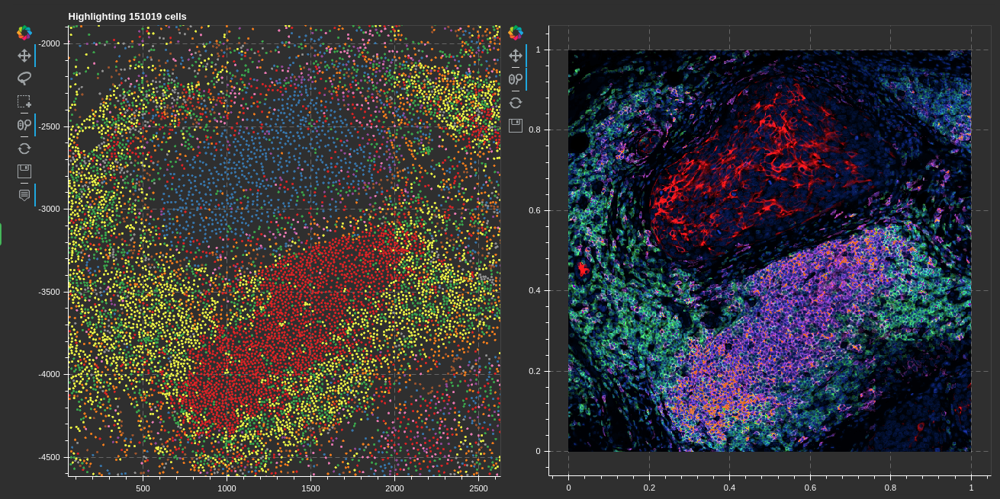

# Micron<sup>2</sup> :microscope:



*****  

- [x] [Segmentation](#segmentation) (via StarDist) :watermelon:
- [x] [CODEX cell dataset](#data-class)
- [ ] [Single cell clustering](#single-cell-clustering)
- [ ] [Niche detection](#niche-detection)
- [ ] [Spatial statistics](#spaital-statistics)
- [ ] Graph analysis
- [ ] [Interactive visualization](#interactive-visualization)


******

With paired scSeq :test_tube::dna:
- [ ] Spatial constraints on interaction analysis (imaging --> scSeq)
- [ ] Interacting cells co-occurance frequency (scSeq --> imaging)
- [ ] Project RNA profiles into CODEX cells

See [snippets](#snippets) for usage.

*****

## Sub-goals

### Data class
- [x] store processed image data + nuclear masks + coordinates in hdf5
- [x] <u>short term</u>: wrapper to use AnnData and store a hook to an open cell image dataset
- [ ] <u>long term</u>: extend the AnnData class

### Segmentation
- [x] pull data from images and perform statistics on these data quickly
- [x] data loader for segmented data focusing on cells, tracking location and cell_ids

### Single cell clustering
- [x] cluster with normalized intensity values
- [x] cluster with morphology + staining
- [ ] (heirarchical or at-once) semi-supervised transfer of cell type labels 

### Niche detection
- [x] k-nearest neighbors graph
- [ ] set embedding with neighborhoods as sets 

### Spatial statistics
- [x] freuqency of neighbor celltypes
- [ ] channel intensities compare neighbors vs non-neighbors for focused celltype
- [ ] fisher test for co-occurance of celltypes within spatial niches
- [ ] mean type-to-type distances
- [ ] spatial staining intensity correlation

### Interactive visualization
- [x] [Bokeh](https://bokeh.org/) for interactive data vis
- [ ] click to show nucleus image
- [x] histogram of image being actively edited
- [ ] select area and export images to file
- [ ] select area/cells and annotate
- [x] composable intensity plot
- [x] dual panes with cells on one side and select a square region to show it
- [ ] focus cluster + neighbors --- histogram of neighbor cell types/integrate with spatial stats
- [ ] widget to gate cells based on bi-variate staining intensity


*****
## Environment

[Miniconda](https://docs.conda.io/en/latest/miniconda.html), 
[RAPIDS](https://rapids.ai/),
[TensorFlow 2](https://www.tensorflow.org/),
[Bokeh](https://bokeh.org/),
[Scanpy](https://scanpy.readthedocs.io/en/stable/)

Note: to use the `leidenlag` package install the proper igraph package from pip: `pip install python-igraph`

*****
## Snippets

Build a cell image dataset:
```python
x
```

Attach a cell image dataset to an AnnData object:
```python
x
```

Run unsupervised clustering on the cell images:
```python
x
```