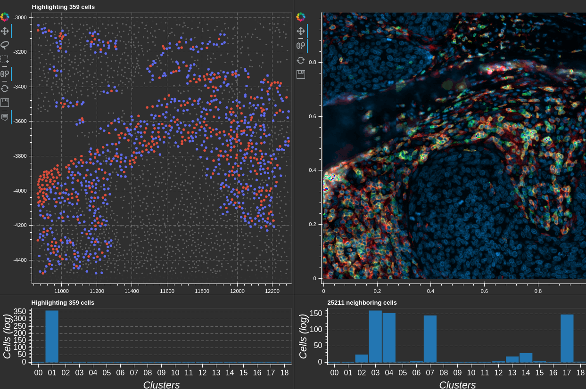

# Micron<sup>2</sup> :microscope:



*****  

- [x] [Segmentation](#segmentation) (via StarDist) :watermelon:
- [x] [CODEX cell dataset](#data-class)
- [x] [Single cell clustering](#single-cell-clustering)
- [ ] [Niche detection](#niche-detection)
- [ ] [Spatial statistics](#spaital-statistics)
- [ ] Graph analysis
- [ ] [Interactive visualization](#interactive-visualization)


******

With paired scSeq :test_tube::dna:
- [ ] Spatial constraints on interaction analysis (imaging --> scSeq)
- [ ] Interacting cells co-occurance frequency (scSeq --> imaging)

See [snippets](#snippets) for usage.

*****

## Sub-goals

### Data class
- [x] store processed image data + nuclear masks + coordinates in hdf5
- [x] short term: wrapper to use AnnData and store a hook to an open cell image dataset
- [ ] long term: extend the AnnData class

### Segmentation
- [x] pull data from images and perform statistics on these data quickly
- [x] data loader for segmented data focusing on cells, tracking location and cell_ids

### Single cell clustering
- [x] cluster with normalized intensity values
- [x] cluster with morphology
- [x] cluster with morphology + staining

### Niche detection
- [ ] nearest neighbors graph (distance cutoff, k-nearest)
- [ ] set embedding 
- [ ] niche stats: cell type co-occurance, mean type-to-type distance 

### Spatial statistics
- [ ] freuqency of neighbor celltypes
- [ ] channel intensities compare neighbors vs non-neighbors for focused celltype
- [ ] fisher test for co-occurance of celltypes within spatial niches

### Interactive visualization
- [x] [Bokeh](https://bokeh.org/) for interactive data vis
- [ ] Click to show nucleus image
- [ ] Select area and export images to file
- [ ] Select area and annotate
- [ ] Composable intensity plot
- [ ] Dual panes with cells on one side and select a square region to show it
- [ ] Focus cluster + neighbors --- histogram of neighbor cell types

*****
## Environment

<!-- Docker: `rapidsai/rapidsai:0.16-cuda10.1-runtime-ubuntu16.04-py3.8` -->
Conda.

Note: to use leidenlag install the proper igraph package from pip: `pip install python-igraph`


*****
## Snippets

Build a cell image dataset:
```python
x
```

Attach a cell image dataset to an AnnData object:
```python
x
```

Run unsupervised clustering on the cell images:
```python
x
```