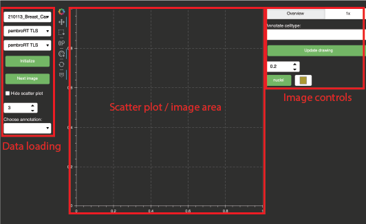

# CODEX celltype trainer

Welcome to this very, very pre-alpha super in-development multiplex image data viewer + annotation + classification interface. This page is meant to provide an orientation to the interface and main functions of the viewer + trainer. For detailed questions or to report things not working it would be helpful to open a new issue.

1. [Loading data](#loading-data)
2. [Using the viewer](#using-the-viewer)
3. [Annotations](#Annotations)
4. [Train and deploy a classifier](#train-and-deploy-a-classifier)

General app layout

-----

## Loading data

Available datasets at the scanning region level are populated in a dropdown menu on th

-----

## Using the viewer

-----

## Annotations

### Loading annotations

### Making new annotations

### Saving annotations

-----

## Train and deploy a classifier