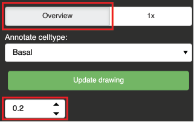
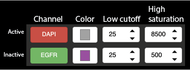

# CODEX celltype trainer orientation

Welcome to this very, very pre-alpha super in-development multiplex image data viewer + annotation + classification interface. This page is meant to provide an orientation to the interface and main functions of the viewer + trainer. For detailed questions or to report things not working it would be helpful to open a new issue.

1. [Loading data](#loading-data)
2. [Using the viewer](#using-the-viewer)
3. [Annotations](#Annotations)
4. [Train and deploy a classifier](#train-and-deploy-a-classifier)

#### Appendices
- [Config files](#config-files)
- [Data directory structure](#data-directory-structure)

General app layout


-----

## Loading data

Available datasets are populated in a dropdown menu on top of the data loading pane. You should select the region and in the next two dropdown menus select config files.

Click `Initialize`.

No data is loaded yet.  
Initialize instructs the viewer to read the configs, and internally we figure out where the source images for the selected dataset reside, read cell centroid data from a CSV, and prepare variables to hold annotation data for each cell (see data directory structure for more information). 
To the right, the image controls will populate widgets to configure the visibility, color, and low/high saturation points for each channel in the color config file.
The celltype config file is used to quickly select combinations of channels. Each `celltype` lists a set of active channels that can be used to distinguish those cells in the image. On initialization, the first-listed celltype is automatically chosen. 

With the dataset initialized, we can move on to loading and viewing an image.

-----

## Using the viewer

On top of the image controls panel, there is a toggle between `Overview` and `1x` mode for image viewing. Keep this on `Overview`.

Also in the image controls panel, there is a numerical input field that is by default set to `0.2`. This field controls the downsampling applied to the Overview image. The suggestion is to use a low resolution (value between 0.05 - 0.2) to set color saturation values, then switch this to higher resolution later. Ecah time the downsampling is changed, press `Next image` to re-load the source images and store them at the new resolution. For large images, e.g. >50,000 cells, full-resolution images may take several minutes to load & send to the browser for viewing.



Leaving all settings default, click `Next image`. 

If you have the terminal process available, you will be able to monitor the process as it loads images from disk, applies the requested downsampling, then assembles the active channels into a merged RGB image. 

The image display area will update, which may take time depending on network latency and the volume of data to be pushed.


Click the scroll wheel icon to enable zooming. Click + drag panning should be enabled by default.

### Setting colors

To avoid high-latency updates with multiple color settings changes, we implement a workflow where color choices are made at-once for multiple channels, then applied by clicking `Update drawing` in the image controls panel. 



- Click the channel name to toggle visibility
- Each channel's color can be set independently by clicking on the color widget
- For each channel, values below the `low cutoff` are set to 0, i.e. made invisible
- For each channel, values above the `high saturation` are clipped. 

Images are colorized so that the intensity range between low cutoff and high saturation map to a point on a uniform color ramp from black (`values = low cutoff`) and the full intensity color (`values = high saturation`). 

The displayed image is a linear combination of the colorized version of each channel after the cutoff/saturation is applied. So, if images appear too 'white' after blending, try to increase the high saturation values for some bright channels. Alternatively, choose a "darker" color. 

A common culprit behind 'white' images is the DAPI (or nuclear) channel, which is set to a light-gray by default, and therefore contributes intensity to all 3 RGB channels. Increasing the DAPI channel saturation value (making it appear dimmer) often frees up intensity range for the other, more interesting, channels to shine.

-----

## Annotations

Annotations can be created and examined through this viewer.

### Loading annotations

### Making new annotations

Annotations are added by clicking the scatterplot points corresponding to an example of the currently active cell type.

### Saving annotations

-----

## Train and deploy a classifier


------

### Config files

We use two config files: celltype config, and color config. These paths are stored in a dictionary written down in `codex_trainer.py`. 

#### Celltype config file
The celltype config file enumerates pre-defined celltypes and the combination of CODEX channels needed to classify these cells. Practically it's possible to blend colors -- assuming relative mutual exclusivity -- up to 5-7 channels. Celltype config is a `json` file that holds a simple dictionary of `key = celltype`, `value = list of channels` as such:

```json
{
  "CD8T": ["DAPI", "PanCytoK", "CD8", "CD4"], 
  "CD4T": ["DAPI", "PanCytoK", "CD8", "CD4"]
}
```

When we initialize a dataset, the chosen config is loaded, and the set of colors listed for the first defined celltype are by default set as active.
Selecting a new celltype from the dropdown menu will first set all channels to `inactive` with their default color from the color config, then set the new set of requested channels to active.

#### Color config file
Color config is a CSV with channel name, default color, low saturation, and high saturation values expressed as ints in the range of the raw uint16 image data. The low and high saturation values are used to control the background level, and max brightness of the channel during construction of the blended image.

When a channel is set as active as a consequence of being listed in a celltype definition, a color wheel is used to automatically set non-conflicting colors for each channel. These may be edited manually before requesting to update the image.

```
channel,color,low,high
DAPI,#a2a2a2,25,20000
CD8,#a2a2a2,25,4000
CD4,#a2a2a2,25,4000
PanCytoK,#a2a2a2,25,4000
```


### Data directory structure

A dataset consists of preprocessed mosaic images, and a CSV listing coordinates of each nucleus in the region. Data is assumed to exist in a directory structure like this:

```text
/data/sample_id/
    sample_id_2_centroids.csv
    images/
        sample_id_cycle00_channel00_DAPI_0.tif
        ....
```

This directory structure is the standard format for CODEX data preprocessed with pyCODEX. 

